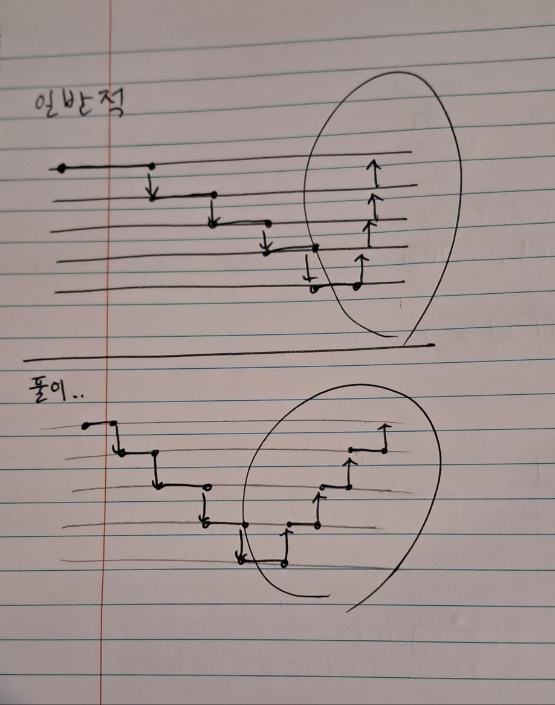

# point: only think about ‘length’

# Subproblem

`N()` 꼴의 반복

# Recursion

### Base case: `)` 발견시

```python
def recur(substring):
	stacked = 0
	counting = 0
	pointer = 0
	while pointer < len(substring):
		if substring[pointer] == '(':
			counting -= 1
			stacked += substring[pointer-1] * recur(substring[pointer+1:]
		elif substring[pointer] == ')':
			return stacked + counting
		else:
			counting += 1
```

# * 풀이가 잘못된 이유

`)` 발견시 return → 해당 값을 토대로 연쇄적 return이 불가능..  
**N() 단위로 청킹한 것이 아니라 순차적으로 탐색했기 때문에 발생한 문제**

